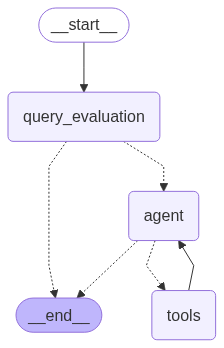

# Agentic RAG System - Chainlit Interface



Welcome to the **Agentic RAG System** - an intelligent document retrieval and question-answering interface built with Chainlit and powered by advanced AI agents.

## 🎯 Overview

This directory contains the complete Agentic RAG application that provides an interactive chat interface for querying your processed document knowledge base. The system uses sophisticated AI agents with specialized tools to deliver accurate, contextual answers from your research papers and documents.

## 📁 Directory Structure

### 🚀 Core Application Files

- **`app_react.py`** - **Main entry point** for the Chainlit application
- **`config.py`** - Centralized configuration settings and parameters
- **`graph_state.py`** - State management for the agent workflow graph
- **`prompts.py`** - All agent prompts and conversation templates
- **`requirements.txt`** - Python dependencies for the application

### 🛠️ Tools & Utilities

- **`tools.py`** - **Standard version** of agent tools for document retrieval and processing
- **`toolsv2.py`** - **Enhanced version** with advanced search capabilities and optimizations
- **`utils.py`** - Utility functions and helper methods
- **`evaluate_tools.py`** - Tool evaluation and performance testing

### 🎨 Assets & Data

- **`public/`** - Static assets including Chainlit logos and UI resources
- **`chainlit.md`** - Welcome message and interface customization
- **`hybrid_search_chunk_ids.json`** - Pre-computed search indices for faster retrieval
- **`eda_papers_knowledge_base.md`** - Knowledge base documentation

### 📊 Evaluation & Analysis

- **`final_eval/`** - Evaluation results and performance metrics
- **`ragas_evaluation_log.txt`** - RAGAS evaluation framework results
- **`enhanced_search_analysis.md`** - Search performance analysis
- **`enhanced_search_log_v2.json`** - Search operation logs

### 🔧 Development & Visualization

- **`visualize_graph.py`** - Graph workflow visualization tools
- **`graph_tutorial_style.py`** - Tutorial-style graph visualization
- **`refactor.md`** - Development notes and refactoring documentation
- **`README_REFACTORING.md`** - Detailed refactoring guidelines

## 🚀 Getting Started

### Prerequisites
```bash
# Install Python dependencies
pip install -r requirements.txt
```

### Running the Application
```bash
# Start the Chainlit interface
chainlit run app_react.py
```

### Configuration
- Configure API keys and settings in `config.py`
- Customize prompts and agent behavior in `prompts.py`
- Choose between standard (`tools.py`) or enhanced (`toolsv2.py`) tool versions

## 🔄 Agent Workflow

The system implements a sophisticated multi-agent workflow:

1. **Query Processing** - Analyze and understand user questions
2. **Document Retrieval** - Search through the knowledge base using hybrid methods
3. **Context Assembly** - Gather relevant information from multiple sources
4. **Answer Generation** - Synthesize comprehensive, accurate responses
5. **Quality Validation** - Ensure answer quality and relevance

## 🎛️ Tool Versions

### Standard Tools (`tools.py`)
- Core document retrieval functionality
- Basic search and filtering capabilities
- Stable and reliable performance

### Enhanced Tools (`toolsv2.py`)
- Advanced semantic search algorithms
- Improved context understanding
- Optimized performance and accuracy
- Extended functionality for complex queries

## 📈 Features

- **Interactive Chat Interface** - User-friendly Chainlit-powered UI
- **Intelligent Document Search** - Advanced retrieval with semantic understanding
- **Multi-Modal Support** - Text, images, and formula processing
- **Real-time Responses** - Fast, contextual answer generation
- **Evaluation Framework** - Built-in performance monitoring and analysis
- **Customizable Prompts** - Easily modify agent behavior and responses

## 🔍 Knowledge Base Integration

The system seamlessly integrates with your processed document knowledge base:
- Accesses chunked and processed papers from `/mistral-ocr/` pipeline
- Utilizes metadata, context, and semantic embeddings
- Provides source attribution and reference links

## 📊 Performance & Evaluation

Monitor system performance through:
- RAGAS evaluation metrics
- Search performance analytics
- User interaction logs
- Tool effectiveness measurements

## 🛠️ Development

### Key Files for Customization:
- **Prompts**: Modify `prompts.py` for different agent behaviors
- **Tools**: Extend `tools.py` or `toolsv2.py` for new capabilities
- **UI**: Customize `chainlit.md` and `public/` assets
- **Config**: Adjust `config.py` for different environments

### Visualization:
Use `visualize_graph.py` to understand and debug the agent workflow graph.

---

*This Agentic RAG system transforms your document collection into an intelligent, queryable knowledge base accessible through a beautiful, conversational interface.* 